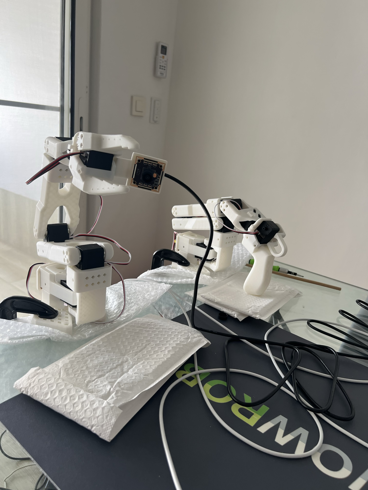
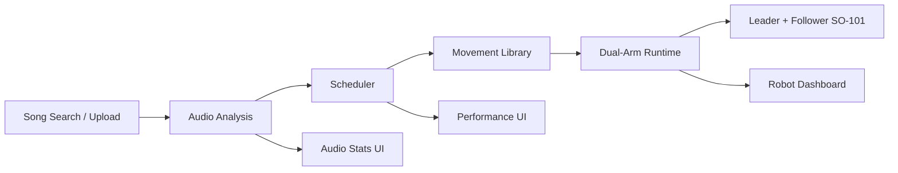

<p align="center">
  
</p>

<h1 align="center">LeJRobot</h1>

<p align="center">
  Music-driven choreography for <strong>LeRobot SO-101</strong> arms.
</p>

<p align="center">
  Search or upload a track, analyze its rhythm and structure, preview the generated movement schedule,
  then run live single-arm or dual-arm motion from a modern control surface.
</p>

<p align="center">
  
  
  
  
</p>

---

## What It Is

LeJRobot is a full-stack dance console built around two ideas:

- `music analysis first`: BPM, sections, energy, and phrase scheduling come from real audio analysis
- `robot motion second`: movements are reusable primitives that can be tested manually or triggered autonomously from the song timeline

The current system targets a `leader + follower` SO-101 setup and already supports:

- local uploads and Jamendo search
- waveform-based playback and performance controls
- audio analysis and phrase scheduling
- manual movement testing
- live telemetry and safety controls
- dual-arm execution modes such as `single`, `unison`, and `mirror`

## Product Flow

1. `Select a song`
   Search Jamendo or upload a local file.
2. `Analyze the track`
   The backend extracts BPM, beat grids, energy, bands, and sections.
3. `Build choreography`
   The scheduler maps the song into movement phrases.
4. `Run the robots`
   Execute manual movements or autonomous playback on the SO-101 arms.

## System Overview



## Stack

### Frontend

- React
- Vite
- Tailwind CSS
- shadcn-style UI primitives
- WaveSurfer.js

### Backend

- FastAPI
- librosa
- NumPy / SciPy
- Feetech servo SDK

## Visual Snapshot

<p align="center">
  
</p>

The project combines:

- a music-first performance UI
- a phrase scheduler tied to analyzed audio
- manual motion tooling for tuning primitives
- live SO-101 telemetry and safety controls

## Current App Surfaces

### Home

- track search and selection
- waveform playback
- scheduled choreography overlay
- autonomous dance start / stop
- compact arm status

### Audio Stats

- spectrogram
- rhythm metrics
- structure timeline
- track metadata and scheduler style controls

### Movements

- reusable movement library
- compact execution target controls
- expandable per-movement tuning
- live manual run / stop

### Robot Dashboard

- arm verification
- connect / disconnect
- torque and dry-run controls
- reset and emergency-stop flows
- live telemetry and 2D arm visualizer

## Interface Design

The interface is intentionally split into focused surfaces instead of one crowded control panel:

- `Home`: performance-first song control and autonomous dance launch
- `Audio Stats`: deeper analysis, phrase structure, and schedule styling
- `Movements`: a compact movement library for testing and tuning primitives
- `Robot Dashboard`: hardware state, safety, and live telemetry

## Features

### Music Analysis

- Jamendo search
- local file upload
- cached analysis pipeline
- BPM and tempo confidence
- beat and downbeat extraction
- section detection
- band-energy and spectral summaries

### Motion System

- oscillator-based motion primitives
- follow-through layer for more fluid motion
- manual movement library
- wave recording, replay, and fitting tools
- phrase scheduler driven by analysis
- autonomous music-linked choreography

### Hardware

- SO-101 leader + follower support
- live telemetry bridge
- neutral pose handling
- emergency stop / reset
- bounded step-limited writes
- mirror and unison dual-arm playback

## Quick Start

Run the app from the repo root:

```bash
./run_app.sh
```

If port `8000` is already taken on your machine:

```bash
APP_BACKEND_PORT=8001 ./run_app.sh
```

Then open:

```text
http://127.0.0.1:5173
```

## Manual Startup

### Backend

```bash
cd backend
python3 -m venv .venv
source .venv/bin/activate
pip install -r requirements.txt
uvicorn app.main:app --reload
```

### Frontend

```bash
cd frontend
npm install
npm run dev
```

## Environment

For Jamendo search, set your own API key:

```bash
export JAMENDO_CLIENT_ID="your_client_id"
```

The project also supports a local `.env.local` file at the repo root.

## Local Uploads

Uploaded tracks are stored under:

```text
.data/uploads/
```

Supported formats:

- `mp3`
- `wav`
- `ogg`
- `flac`
- `m4a`
- `aac`

## Docker

Run the full stack with Docker Compose:

```bash
docker compose up --build
```

## Motion Tooling

### Demo the wave primitive

```bash
cd backend
source .venv/bin/activate
python scripts/demo_wave_motion.py --preset normal --format json
```

### Record and fit a manual wave

```bash
cd backend
source .venv/bin/activate
python scripts/record_wave_demo.py --arm-id thejn_leader_arm --label manual-wave-01
python scripts/fit_wave_from_recordings.py ../.data/movements/recordings/<recording>.json --print-preset
python scripts/replay_wave_demo.py ../.data/movements/recordings/<recording>.json --arm-id thejn_follower_arm --live
```

## Project Layout

```text
frontend/   React app, performance UI, movement library, robot dashboard
backend/    FastAPI app, analysis pipeline, scheduler, hardware bridge
docs/       contracts, implementation notes, README assets
.data/      uploads, caches, local runtime data
```

## Development Workflow

Feature work is intended to go through:

1. issue
2. branch
3. PR
4. merge to `main`

CI validates backend, frontend, and Docker-related flows on pull requests.

## Status

The project already supports:

- real audio analysis
- movement scheduling
- manual movement execution
- autonomous playback linked to song transport
- live SO-101 telemetry and safety controls

The next major direction is deeper choreography quality: richer movement vocabulary, stronger music-to-motion mapping, and more polished autonomous performance behavior.

## Inspiration

LeJRobot is not trying to be a generic robot dashboard. The goal is to make the SO-101 arms feel performative:

- the song should clearly drive the dance
- movement primitives should stay readable and tunable
- the interface should feel closer to a performance console than an admin panel
